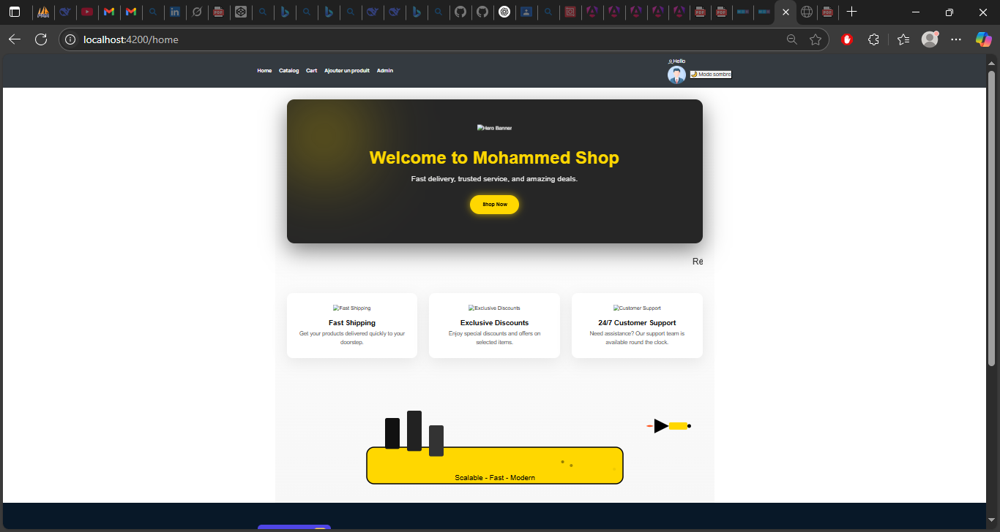
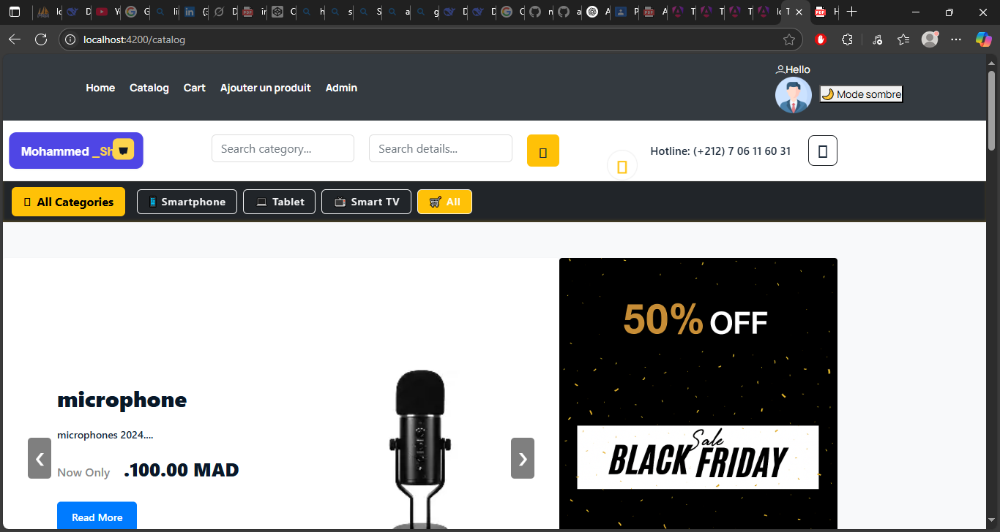
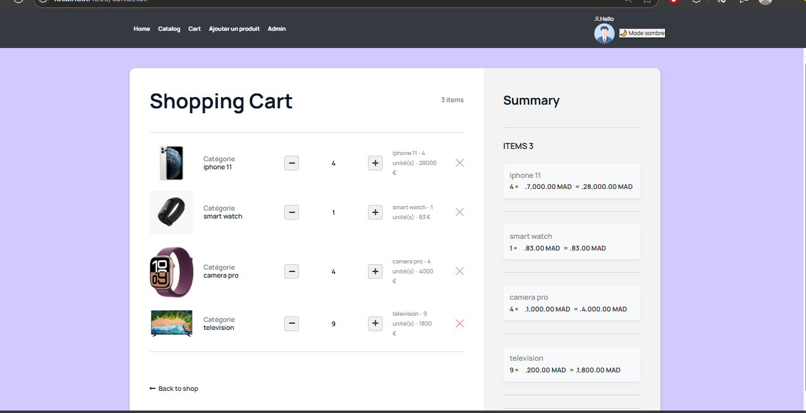
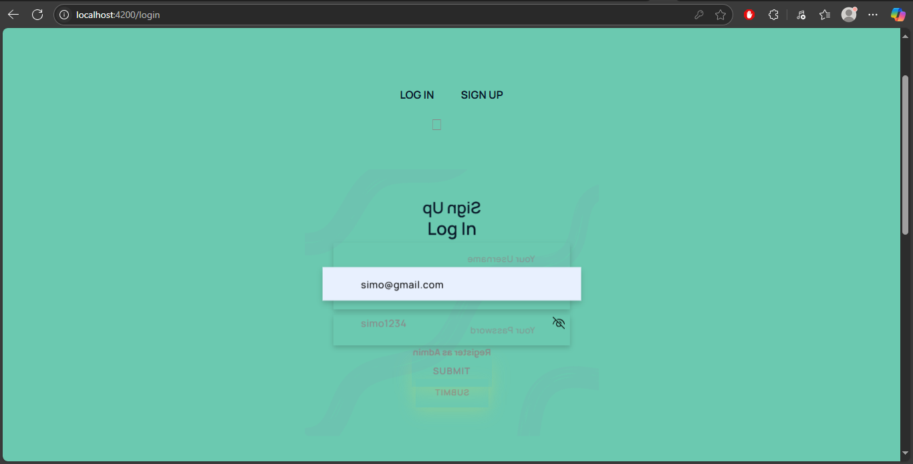
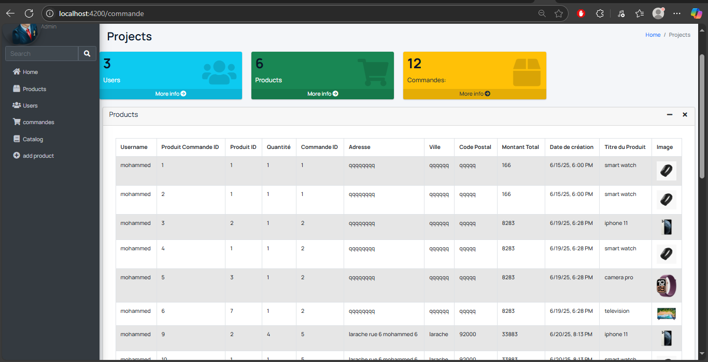

# 🛒 Mohammed Shop - Projet e-Commerce

## 👤 Auteur
**Nom :** Khayari Mohammed  
**Master :** DevOps et Cloud Computing  
**Université :** Abdelmalek Essaâdi – FPL Larache  
**Année universitaire :** 2024/2025

---

## 📌 Description du projet

Ce projet a pour objectif de développer une application web de commerce électronique permettant de vendre des produits en ligne. L’application propose une interface fluide et responsive, une gestion sécurisée des utilisateurs, ainsi qu’un système complet de gestion de catalogue, panier, commandes, stock et offres.

---
# Mohammed Shop - Projet E-commerce

## 🚀 Installation et lancement du projet

### 1. Cloner le dépôt


git clone https://github.com/moahmmed-el-khaiari/tp_angular_mohammed_elkhaiari.git
cd tp_angular_mohammed_elkhaiari
## 🔧 Technologies utilisées

### 🎨 Frontend (Angular)
- Angular 17
- TypeScript
- Angular Router
- RxJS
- ngx-translate (i18n)
- SCSS / CSS Animé
- Responsive design


cd backend
# Installer Maven Wrapper si nécessaire, puis lancer l’application
./mvnw spring-boot:run
### ⚙️ Backend (Spring Boot)
- Spring Boot 3
- Spring Security (authentification et rôles)
- Spring Data JPA (accès base de données)
- Hibernate ORM
- MySQL / PostgreSQL

### 🛠 Autres outils
- Git / GitHub
- Postman (test d’API)
- VS Code / IntelliJ
- Angular CLI / Maven

---
cd ../frontend
npm install
ng serve
## 🗂 Fonctionnalités principales

- ✅ Authentification / inscription / rôles (Admin, Client)
- 📦 Gestion du catalogue produits (filtrage, quantité, offres)
- 🛒 Gestion du panier et passage de commande
- 🔄 Suivi des commandes (statut, historique)
- 📉 Suivi de stock avec alertes
- 🎁 Gestion des offres et promotions
- 🌍 Interface multilingue (internationalisation i18n)
- 🌙 Mode sombre / clair
- 👤 Espace profil utilisateur

---
## 📸 Captures d’écran de l’application

### 🏠 Page d'accueil


### 🛒 Catalogue des produits


### 🧺 Panier


### 👤 Connexion utilisateur


### 📊 Espace Admin



L’application est structurée selon une architecture client-serveur :

```text
[Utilisateur]
    ↓
[Angular Frontend]
    ↓ REST API (JSON)
[Spring Boot Backend]
    ↓
[Base de données relationnelle]
